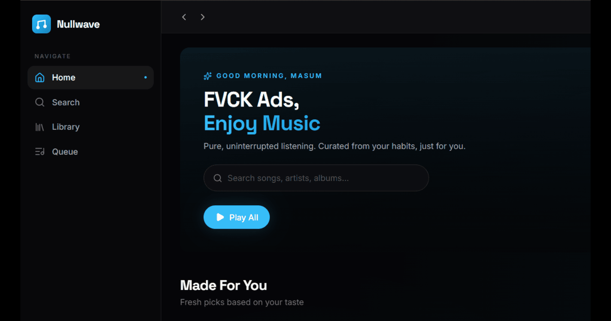

<div align="center">

  

  <br />
  <br />

  # 🌊 NullWave

  **An experimental, educational front-end music streaming interface.**
  
  Created by **Atif Arman** (exotic Atif)

  <br />

  [](https://thenullwave.vercel.app)
  [](https://reactjs.org/)
  [](https://www.typescriptlang.org/)
  [](https://vitejs.dev/)
  [](https://tailwindcss.com/)
  [](https://supabase.com/)

</div>

---

## ✨ Features

- 🎧 **Experimental Audio Player** - A custom React-based audio player built for learning purposes.
- 🚫 **Zero Ads** - A clean, uninterrupted interface designed to showcase UI/UX concepts.
- 🎨 **Sleek UI/UX** - A gorgeous dark-mode interface with glassmorphism and micro-animations.
- 📻 **Dynamic Queueing** - Experimental logic that populates the queue based on listening history.
- 🎛️ **Audio Visualizer** - Built-in canvas visualizer in the Fullscreen Player for audio frequency analysis.
- 📱 **Mobile Optimized** - A native-feeling bottom navigation bar and responsive mobile player.

---

## ⚠️ Disclaimer & Educational Purpose

**NullWave is strictly an experimental and educational project.** 
- We **do not host, store, or distribute** any copyrighted media files or music on our servers.
- This project is a proof-of-concept front-end interface built to explore web audio APIs, React state management, and modern UI design.
- All data, including audio streams, is aggregated from third-party public APIs and services.
- This is not a commercial product and is not intended for commercial use.

---

## 🛠️ Local Development

Want to run NullWave locally? It's simple.

### Prerequisites
- Node.js (v18+)
- npm or pnpm
- Supabase account (for DB)

### Setup

1. **Clone the repository:**
   ```bash
   git clone https://github.com/exotic-atif/nullwave.git
   cd nullwave
   ```

2. **Install dependencies:**
   ```bash
   npm install
   ```

3. **Environment Variables:**
   Create a `.env` file in the root directory and add your Supabase credentials:
   ```env
   VITE_SUPABASE_URL=your_supabase_url
   VITE_SUPABASE_ANON_KEY=your_supabase_anon_key
   ```

4. **Start the development server:**
   ```bash
   npm run dev
   ```

5. **Open your browser:**
   Navigate to `http://localhost:5173`

---

## 👤 Author

**Atif Arman** 
- GitHub: [@exotic-atif](https://github.com/exotic-atif)

---

<div align="center">
  <sub>Built with ❤️ for the underground music scene.</sub>
</div>
